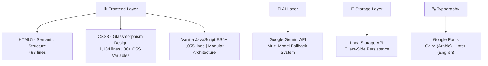
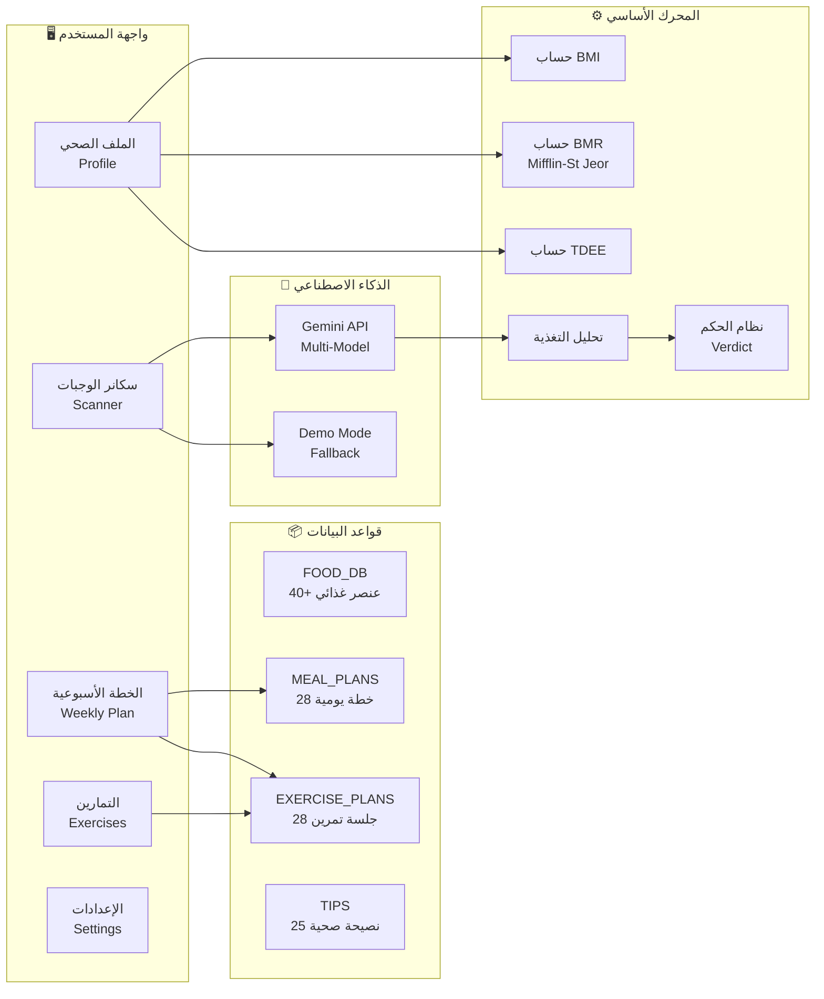
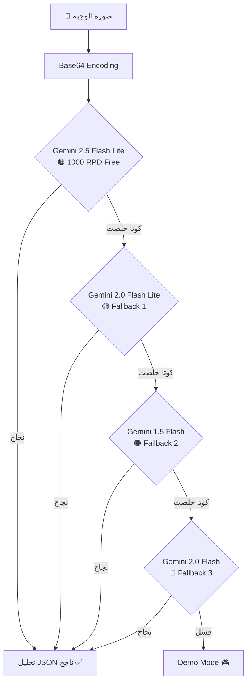
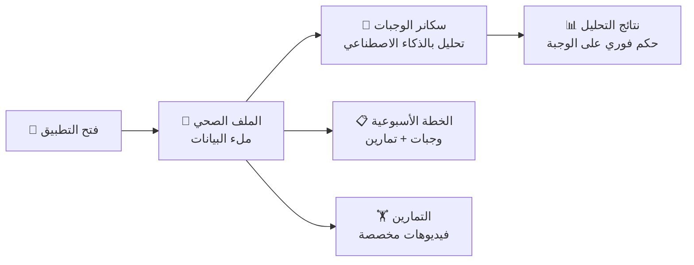

<div dir="rtl" align="right">

---

<div align="center">

# 🔬 ورقة بحثية تقنية

## InsulanCore — نظام ذكي لإدارة صحة مرضى السكري ومقاومة الأنسولين

### تطبيق ويب بالذكاء الاصطناعي لتحليل الوجبات واقتراح أنظمة حياة صحية مخصصة

---

**كلية التربية الرياضية — قسم العلوم الصحية والتغذية الرياضية**

**مارس 2026**

---

</div>

## 📋 فهرس المحتويات

| # | العنوان |
|---|---------|
| 1 | المقدمة وبيان المشكلة |
| 2 | أهداف المشروع |
| 3 | التقنيات المستخدمة والهندسة البرمجية |
| 4 | وحدات النظام وتفصيل المكونات |
| 5 | الخوارزميات الطبية والحسابات العلمية |
| 6 | نظام الذكاء الاصطناعي لتحليل الوجبات |
| 7 | تصميم واجهة المستخدم (UI/UX) |
| 8 | أمن البيانات والخصوصية |
| 9 | النتائج والتقييم |
| 10 | الخلاصة والتطوير المستقبلي |

---

## 1. 📌 المقدمة وبيان المشكلة

### 1.1 الخلفية العلمية

يُعدّ مرض السكري ومقاومة الأنسولين من أكثر الأمراض المزمنة انتشارًا في العالم العربي، حيث تشير إحصائيات **الاتحاد الدولي للسكري (IDF)** لعام 2025 إلى أن حوالي **55 مليون شخص** في منطقة الشرق الأوسط وشمال أفريقيا مصابون بالسكري، مع توقعات بزيادة هذا العدد بنسبة **86%** بحلول 2045.

### 1.2 المشكلة البحثية

يعاني المرضى من ثلاث تحديات رئيسية:

| التحدي | الوصف |
|--------|-------|
| **صعوبة حساب السعرات** | عدم القدرة على معرفة المحتوى الغذائي للوجبات اليومية بدقة |
| **غياب الخطة الشخصية** | عدم توفر نظام غذائي ورياضي مخصص للحالة الصحية الفردية |
| **ضعف الوعي الغذائي** | عدم معرفة تأثير كل وجبة على مستوى السكر في الدم |

### 1.3 الحل المقترح

تطبيق **InsulanCore** — نظام ويب ذكي متكامل يجمع بين:
- **الذكاء الاصطناعي** (Google Gemini API) لتحليل صور الوجبات تلقائيًا
- **خوارزميات طبية معتمدة** لحساب BMI و BMR و TDEE
- **قاعدة بيانات غذائية عربية** شاملة مع مؤشر نسبة السكر في الدم (Glycemic Index)
- **خطط تغذية ورياضة مخصصة** لكل حالة صحية

---

## 2. 🎯 أهداف المشروع

### 2.1 الأهداف الرئيسية

```
✅ بناء نظام ذكي لتحليل الوجبات عبر التصوير الفوتوغرافي
✅ توفير حسابات صحية دقيقة (BMI, BMR, TDEE)
✅ تصميم خطط تغذية أسبوعية مخصصة لـ 5 حالات صحية
✅ اقتراح برامج تمارين مناسبة لـ 4 مستويات نشاط
✅ تقديم توجيهات صحية فورية بناءً على تحليل كل وجبة
```

### 2.2 الفئة المستهدفة

| الفئة | الحالة |
|-------|--------|
| مرضى السكري النوع الأول | `diabetes1` |
| مرضى السكري النوع الثاني | `diabetes2` |
| مقاومة الأنسولين | `insulin_resistance` |
| السمنة | `obesity` |
| ما قبل السكري | `prediabetes` |

---

## 3. 🛠️ التقنيات المستخدمة والهندسة البرمجية

### 3.1 مكدس التقنيات (Technology Stack)



### 3.2 المقاييس الهندسية (Engineering Metrics)

| المقياس | القيمة | الدلالة |
|---------|--------|---------|
| إجمالي أسطر الكود | **2,737 سطر** | مشروع متوسط-كبير الحجم |
| HTML | 498 سطر (29 KB) | هيكل دلالي نظيف |
| CSS | 1,184 سطر (24 KB) | تصميم متقدم مع 30+ متغير |
| JavaScript | 1,055 سطر (55 KB) | منطق تطبيقي شامل |
| CSS Variables | 30+ متغير | تصميم قابل للتعديل |
| عناصر الطعام في قاعدة البيانات | 40+ عنصر | تغطية واسعة للمطبخ العربي |
| خطط وجبات أسبوعية | 28 يوم (4 أهداف × 7 أيام) | تنوع كامل |
| خطط تمارين | 28 جلسة (4 مستويات × 7 أيام) | تناسب كل المستويات |
| نصائح صحية | 25 نصيحة (5 حالات × 5 نصائح) | مخصصة لكل حالة |

### 3.3 المبادئ الهندسية المُتّبعة

> **1. Separation of Concerns (فصل المسؤوليات)**
> - كل وحدة وظيفية في ملف مستقل (HTML للهيكل، CSS للتصميم، JS للمنطق)
> - داخل JavaScript: تقسيم واضح بأقسام مُعلّقة (FOOD_DB, MEAL_PLANS, EXERCISE_PLANS, etc.)

> **2. Progressive Enhancement (التحسين التدريجي)**
> - يعمل بدون API Key عبر Demo Mode
> - نظام Fallback متعدد المستويات للذكاء الاصطناعي

> **3. Data Persistence (استمرارية البيانات)**
> - حفظ تلقائي مع Debouncing (500ms)
> - استعادة البيانات عند إعادة فتح التطبيق

> **4. User-Centric Design (تصميم يركز على المستخدم)**
> - واجهة عربية RTL كاملة
> - توست إشعارات ذكية
> - رسائل خطأ واضحة ومفهومة

---

## 4. 🧩 وحدات النظام وتفصيل المكونات

### 4.1 مخطط معماري



### 4.2 تفصيل كل وحدة

#### 🔹 وحدة الملف الصحي (Health Profile Module)

| الحقل | النوع | النطاق | الغرض |
|-------|------|--------|-------|
| الاسم | نص | — | تعريف المستخدم |
| السن | رقم | 10 - 100 | حساب BMR |
| الجنس | اختيار | ذكر / أنثى | معادلة BMR |
| الوزن | رقم | 30 - 300 كجم | BMI و BMR |
| الطول | رقم | 100 - 250 سم | BMI |
| مستوى النشاط | اختيار | 4 مستويات | مضاعف TDEE |
| الحالة الصحية | اختيار | 5 حالات | تخصيص النصائح |
| الهدف | اختيار | 4 أهداف | خطة التغذية |
| سكر الدم الصائم | رقم | 50 - 500 mg/dL | تقييم إضافي |
| HbA1c | رقم | 3 - 15 % | متابعة طويلة المدى |

#### 🔹 وحدة السكانر الذكي (AI Scanner Module)

```
المستخدم يرفع صورة الوجبة
         ↓
  Gemini API يحلل الصورة
         ↓
  يكتشف الأصناف ▸ ["أرز أبيض 🍚", "فراخ 🍗", "سلطة 🥗"]
         ↓
  المستخدم يحدد الوزن بالجرام لكل صنف
         ↓
  حساب السعرات والماكروس من FOOD_DB
         ↓
  توليد الحكم (Verdict): مناسبة ✅ / مقبولة ⚠️ / غير مناسبة ❌
```

#### 🔹 وحدة الخطة الأسبوعية (Weekly Plan Module)

- **4 خطط تغذية** مخصصة لكل هدف (إنقاص الوزن، تثبيت السكر، بناء العضلات، صحة عامة)
- **7 أيام** كاملة لكل خطة مع 4 وجبات يومية
- **حساب تلقائي** للأهداف اليومية (سعرات، مياه، كربوهيدرات، دقائق تمرين)
- **خطة تمارين** مخصصة لـ 4 مستويات نشاط

---

## 5. 🧮 الخوارزميات الطبية والحسابات العلمية

### 5.1 مؤشر كتلة الجسم (BMI)

```
BMI = الوزن (كجم) ÷ (الطول بالمتر)²
```

| التصنيف | القيمة |
|---------|--------|
| نحيف | أقل من 18.5 |
| طبيعي ✅ | 18.5 – 24.9 |
| وزن زائد ⚠️ | 25 – 29.9 |
| سمنة 🔴 | 30 فأكثر |

### 5.2 معدل الأيض الأساسي BMR — معادلة Mifflin-St Jeor

هذه المعادلة هي **الأكثر دقة** وفقًا للمراجعات العلمية الحديثة:

```
📘 للذكور:   BMR = (10 × الوزن) + (6.25 × الطول) - (5 × العمر) + 5
📕 للإناث:   BMR = (10 × الوزن) + (6.25 × الطول) - (5 × العمر) - 161
```

### 5.3 إجمالي الإنفاق اليومي من الطاقة (TDEE)

```
TDEE = BMR × معامل النشاط
```

| مستوى النشاط | المعامل | الوصف |
|-------------|---------|-------|
| خامل (Sedentary) | 1.2 | عمل مكتبي بدون رياضة |
| نشاط خفيف (Light) | 1.375 | 1-2 مرات رياضة/أسبوع |
| نشاط متوسط (Moderate) | 1.55 | 3-5 مرات/أسبوع |
| نشط جداً (Active) | 1.725 | 6-7 مرات/أسبوع |

### 5.4 السعرات المستهدفة حسب الهدف

```
🔻 إنقاص الوزن:      TDEE - 500 سعر (عجز ≈ 0.5 كجم/أسبوع)
💪 بناء العضلات:      TDEE + 300 سعر (فائض بنائي)
⚖️ تثبيت / صحة عامة:  TDEE كما هو
```

### 5.5 حساب الكربوهيدرات القصوى

```
🩺 مرضى السكري / مقاومة الأنسولين:
   Max Carbs = (السعرات المستهدفة × 0.35) ÷ 4 جم   ← 35% فقط من الطاقة

🟢 حالات أخرى:
   Max Carbs = (السعرات المستهدفة × 0.45) ÷ 4 جم   ← 45% من الطاقة
```

### 5.6 حساب المياه المطلوبة

```
المياه (لتر) = الوزن (كجم) × 30 مل ÷ 1000
```

---

## 6. 🤖 نظام الذكاء الاصطناعي لتحليل الوجبات

### 6.1 البنية المعمارية

يستخدم النظام **Google Gemini Vision API** مع إستراتيجية **Multi-Model Fallback** ذكية:



### 6.2 هندسة الـ Prompt

```
أنت خبير تغذية متخصص في تحليل صور الطعام.
شوف الصورة دي وحدد كل الأصناف الموجودة في الوجبة.
المطلوب: رد بـ JSON array فقط، بالشكل ده:
[{"name": "اسم الصنف بالعربي", "emoji": "إيموجي مناسب"}]
```

### 6.3 معالجة الأخطاء (Error Handling)

| الخطأ | المعالجة |
|-------|---------|
| `429 Rate Limit` | الانتقال للموديل التالي تلقائيًا |
| `Quota Exceeded` | انتقال + إشعار المستخدم |
| صورة غير أكل | إرجاع مصفوفة فارغة `[]` |
| كل الموديلات فشلت | رسالة واضحة + اقتراح Demo Mode |

### 6.4 قاعدة البيانات الغذائية

تتضمن **40+ عنصر غذائي** من المطبخ العربي والمصري، لكل عنصر:

| الخاصية | الوصف |
|---------|-------|
| `calories` | سعرات حرارية لكل 100 جم |
| `carbs` | كربوهيدرات (جم/100جم) |
| `protein` | بروتين (جم/100جم) |
| `fat` | دهون (جم/100جم) |
| `sugar` | سكريات (جم/100جم) |
| `fiber` | ألياف (جم/100جم) |
| `gi` | مؤشر الجلايسيمي (Glycemic Index) |

**أمثلة من قاعدة البيانات:**

| الصنف | السعرات | الكربوهيدرات | البروتين | GI |
|-------|---------|-------------|----------|-----|
| 🍚 أرز أبيض | 130 | 28g | 2.7g | 73 (عالي) |
| 🍗 فراخ مشوية | 165 | 0g | 31g | 0 |
| 🫘 فول | 88 | 11g | 7.6g | 40 (منخفض) |
| 🫓 عيش بلدي | 275 | 55g | 9.4g | 70 (عالي) |
| 🧆 طعمية | 333 | 32g | 13g | 40 (منخفض) |
| 🥗 سلطة | 20 | 3.5g | 1.3g | 15 (منخفض جدًا) |
| 🍲 كشري | 160 | 30g | 5g | 65 (متوسط) |

### 6.5 نظام الحكم الذكي (Verdict System)

النظام يقيّم كل وجبة بناءً على **الملف الصحي الشخصي** للمستخدم:

```
الوجبة مقارنة بـ 40% من الحد اليومي (لأن كل وجبة ≈ 40% من اليوم)
         ↓
    فحص السعرات الحرارية
    فحص الكربوهيدرات (مهم جدًا لمرضى السكري)
    فحص السكريات
    فحص الألياف
         ↓
    🟢 مناسبة | 🟡 مقبولة | 🔴 غير مناسبة
         ↓
    نصائح مخصصة فورية (مثل: "امشي 20 دقيقة بعد الوجبة")
```

---

## 7. 🎨 تصميم واجهة المستخدم (UI/UX)

### 7.1 فلسفة التصميم

| المبدأ | التطبيق |
|--------|---------|
| **Glassmorphism** | خلفيات شفافة مع `backdrop-filter: blur(20px)` |
| **Dark Theme Premium** | لون أساسي `#0a0e1a` مريح للعين |
| **Gradient Accent** | تدرج `#00d4aa → #7c3aed` (أخضر-بنفسجي) |
| **Micro-animations** | حركات انتقالية ناعمة على كل العناصر |
| **RTL Native** | تصميم عربي أصيل من الأساس |

### 7.2 نظام التصميم (Design System)

```
🎨 أكثر من 30 متغير CSS لاتساق مثالي
🖼️ نظام بطاقات زجاجية (Glass Cards) موحد
📱 تصميم متجاوب (Responsive) لـ 3 نقاط كسر: 600px, 400px
✨ 6 أنيميشن مختلفة: float, slideUp, slideDown, fadeIn, pulse, spin
🎛️ 5 أنماط أزرار: primary, secondary, demo, danger
🔔 نظام إشعارات Toast مع تصنيف ألوان
🎯 Custom Scrollbar بتصميم مخصص
```

### 7.3 تجربة المستخدم (UX)



---

## 8. 🔒 أمن البيانات والخصوصية

| الميزة | التفصيل |
|--------|---------|
| **تخزين محلي فقط** | كل البيانات في `localStorage` — لا شيء يوصل لسيرفر خارجي |
| **لا يوجد Backend** | تطبيق Client-Side بالكامل |
| **مفتاح API آمن** | حقل `type="password"` لإخفاء المفتاح |
| **مسح البيانات** | زر "مسح كل البيانات" متاح في الإعدادات |
| **بدون تسجيل حساب** | لا يتطلب بريد إلكتروني أو بيانات شخصية على سيرفر |

---

## 9. 📊 النتائج والتقييم

### 9.1 الإنجازات التقنية

| ✅ الإنجاز | الأهمية |
|-----------|---------|
| نظام AI Fallback متعدد الموديلات | ضمان الاستمرارية حتى عند نفاد كوتا موديل |
| قاعدة بيانات غذائية عربية بـ GI | أول نظام يجمع بين القيم الغذائية والجلايسيمي للمطبخ العربي |
| حسابات طبية معتمدة (Mifflin-St Jeor) | دقة علمية في حسابات BMR |
| تصميم Glassmorphism متقدم | واجهة بصرية على مستوى احترافي عالمي |
| دعم RTL كامل | تجربة عربية أصيلة بدون أي مشاكل عرض |
| تخزين محلي بـ Auto-save | لا حاجة لسيرفر — يعمل أوفلاين بعد أول تحميل |
| Demo Mode | إمكانية تجربة كل الخصائص بدون API Key |

### 9.2 مؤشرات الجودة الهندسية

| المؤشر | التقييم |
|--------|---------|
| **Code Organization** | ممتاز — أقسام واضحة مُعلّقة |
| **Error Handling** | ممتاز — معالجة شاملة لكل حالات الخطأ |
| **Scalability** | جيد جدًا — قاعدة البيانات قابلة للتوسيع |
| **Accessibility** | جيد — `semantic HTML` + `labels` + `RTL` |
| **Performance** | ممتاز — Vanilla JS بدون frameworks ثقيلة |
| **Responsiveness** | ممتاز — يعمل على الموبايل والتابلت والديسكتوب |

---

## 10. 📝 الخلاصة والتطوير المستقبلي

### 10.1 الخلاصة

يقدم مشروع **InsulanCore** حلاً تقنيًا متكاملاً وعمليًا لمساعدة مرضى السكري ومقاومة الأنسولين في إدارة حياتهم الصحية. يجمع المشروع بين:

- **الذكاء الاصطناعي** لتحليل الوجبات بمجرد التقاط صورة
- **الخوارزميات الطبية المعتمدة** لحسابات دقيقة وموثوقة
- **التصميم الحديث** الذي يشجع على الاستخدام المستمر
- **الخصوصية الكاملة** بتخزين كل البيانات محليًا

### 10.2 خطة التطوير المستقبلي

| المرحلة | التطوير |
|---------|---------|
| **المرحلة القادمة** | إضافة رسوم بيانية لتتبع السكر والوزن عبر الزمن |
| **المرحلة الثانية** | ربط مع أجهزة قياس السكر عبر Bluetooth |
| **المرحلة الثالثة** | تطبيق موبايل (PWA) مع إشعارات مواعيد الوجبات |
| **المرحلة الرابعة** | إضافة AI Coach محادثة ذكية مع المستخدم |

---

<div align="center">

### 📂 ملفات المشروع

| الملف | الحجم | الوصف |
|-------|------|-------|
| [index.html](file:///d:/insulancore/index.html) | 29 KB | الهيكل الأساسي — 498 سطر |
| [style.css](file:///d:/insulancore/style.css) | 24 KB | التصميم والأنيميشن — 1,184 سطر |
| [script.js](file:///d:/insulancore/script.js) | 55 KB | المنطق والخوارزميات — 1,055 سطر |

---

**InsulanCore © 2026 — كلية التربية الرياضية**

*تم تطوير هذا المشروع بأعلى معايير الهندسة البرمجية الحديثة*

---

</div>

</div>
